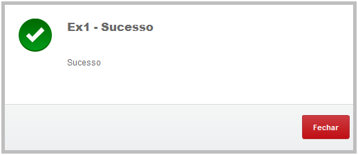
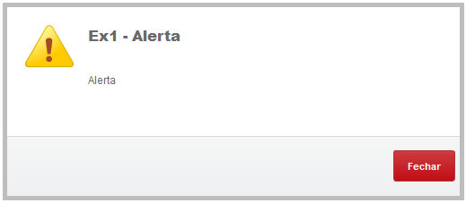
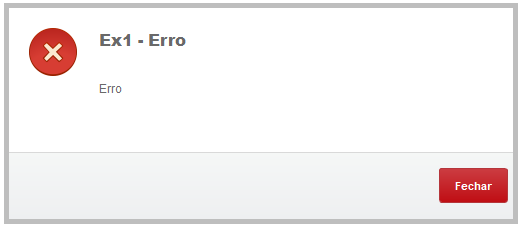
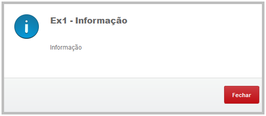
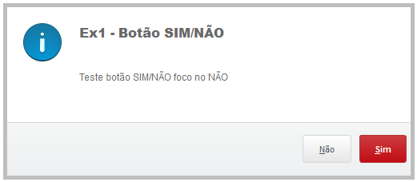
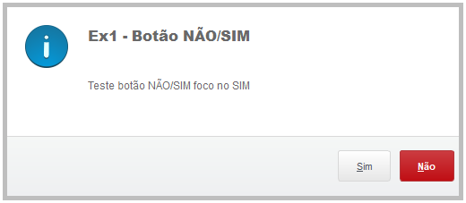

# msg-modal

Função para mostrar uma modal desenvolvida na linguagem TL++ (Linguagem proprietária da TOTVS).

<br />

1. [Definição](#Definição)
1. [Parametros](#Parametros)
1. [Compilação](#Compilação)
    - [Sem include](#Sem\ include)
    - [Com include](#Com\ include)
1. [Exemplos](#Exemplos)

<br />

## Definição
Função destinada a substituir funções padrões TOTVS Protheus como 'msginfo', 'msgstop', 'msgalert', 'msgyesno', 'msgnoyes', além de implementar um modal com ícone de sucesso. É de conhecimento que já existem funções padrões que executam as funções acima citadas, entre tanto são funções separadas e não possuem o ícone de sucesso, através da função aqui desenvolvida podemos centralizar as mensagem modal e manter a aparencia do sistema padrão.

<br />

## Parametros
Confira abaixo as valores possíveis assim como as regras de obrigatoriedade.
Parâmetro | Tipo | Valores possíveis | Valor default | Obrigatório
:-------------:|:-------------:|:-------------:|:-------------:|:-------------:
cMessage | caracter | Texto | | x
cTitle | caracter | Texto | " " |
nTypeIcon | numérico |1 = Sucesso<br>2 = Alerta<br>3 = Erro<br>4 = Informação | 4 |
nTypeButton | numérico |1 = Fechar<br>2 = Sim/Não<br>3 = Não/Sim | 1 |

<br />

## Compilação
### Sem include
Para fazer uso da função como função de usuário padrão, ou seja, utilizando 'U_' antes da chamada, basta compilar o fonte 'msgmodal.tlpp' e usar conforme o exemplo 1.

Ex.:  
```tlpp
U_msgmodal("message", "title", 1)
```


### Com include
Para utilizar a função de forma personalizada sem o uso do 'U_' ou em forma de COMANDOS basta colocar o include 'msgmodal.ch' presente na pasta 'includes/' na sua pasta de includes e usar conforme o exemplo 2.

Ex. função: 
```tlpp
msgmodal("message", "title", 1, 1)
```

Ex. comando:
```tlpp
MSG "message" TITLE "title" ICON 1 BUTTON 1
```
<br />

## Exemplos

Modal com ícone de sucesso.

<br />

Modal com ícone de alerta.

<br />

Modal com ícone de erro.

<br />

Modal com ícone de informação.

<br />

Modal com botões SIM/Não com foco no SIM.

<br />

Modal com botões NÃO/SIM com foco no NÃO.
